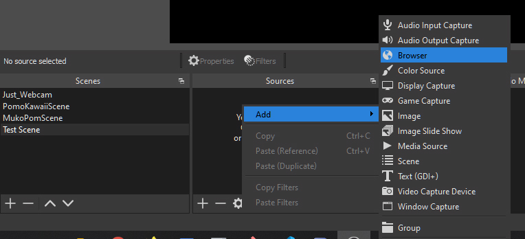
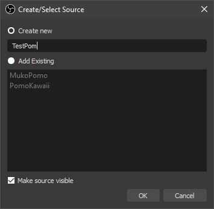
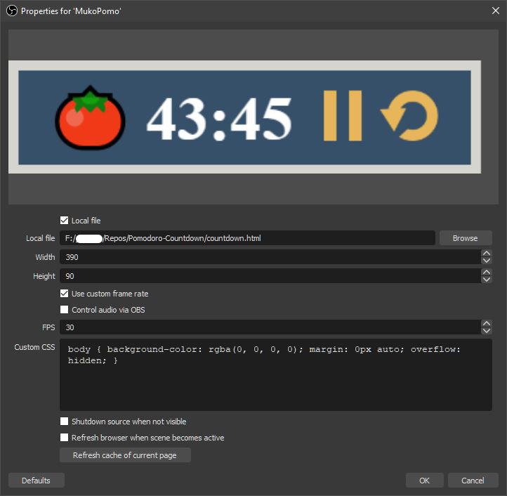
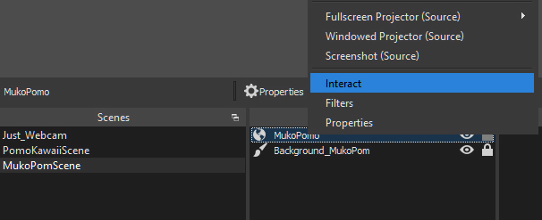
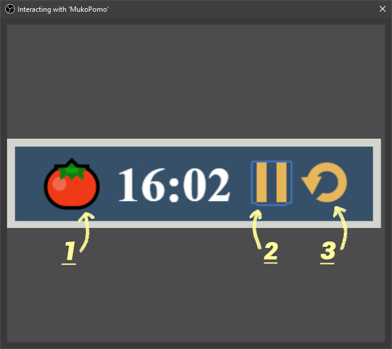

<br />
<p align="center">
  <a href="https://github.com/hellomayuko/Pomodoro-Countdown">
    🍅
  </a>

  <h3 align="center">Pomodoro Countdown Timer</h3>

  <p align="center">
    A Pomodoro Countdown widget for my Twitch streams!
  </p>
</p>

## About The Project

An interactive Pomodoro Counter widget for OBS.


## Installation

1. Clone the repo or download the zip [here](https://github.com/hellomayuko/Pomodoro-Countdown/archive/master.zip)

   ```sh
   git clone https://github.com/hellomayuko/Pomodoro-Countdown.git
   ```
  
2. Store files wherever you wish.

## Set up in OBS

1. Create a browser source in your scene.


2. Name your browser source *(ex. PomodoroTimerWidget)*


3. Setup as seen in image
    ```
    Local file - Checked
    Local file address - Select countdown.html
    Width - 380
    Height - 90
    ```
    

## How to use

1. Right-click the timer in Sources and press `Interact`


2. Interact with the buttons!
   ```
   1. Change the timer between 25min & 50min
   2. Resume/Pause timer
   3. Reset timer
   ```
   